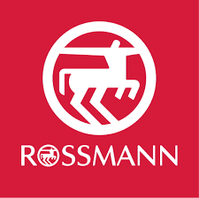
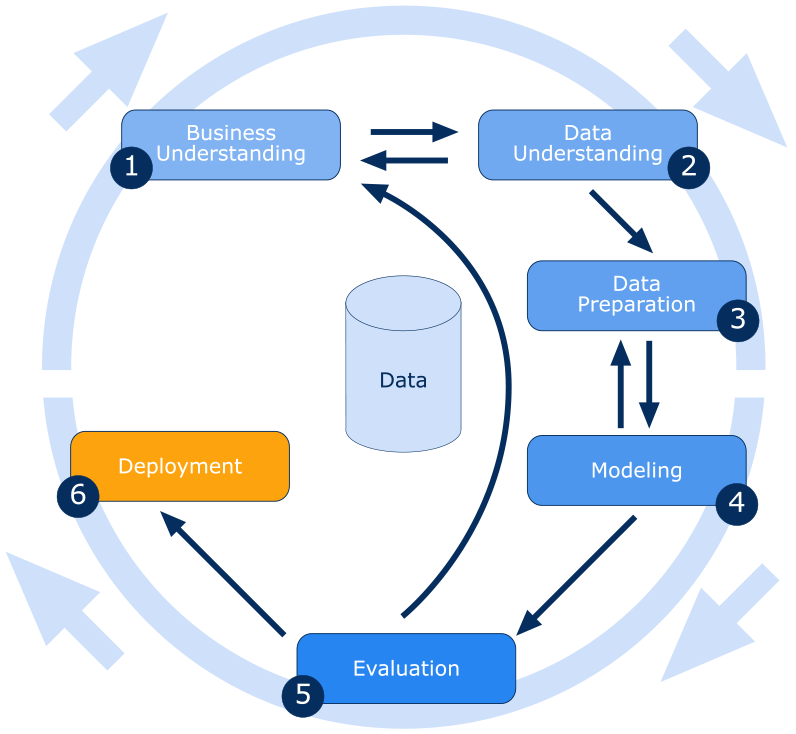
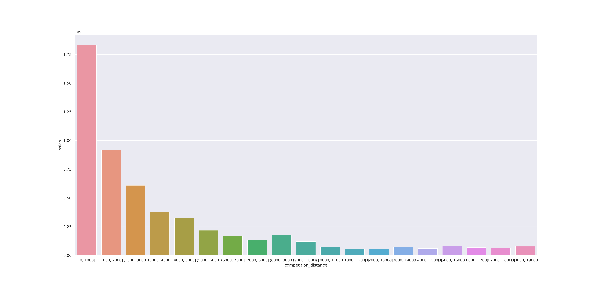
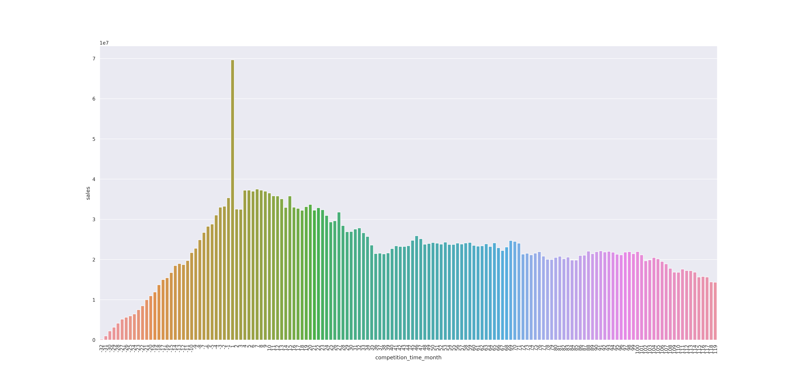
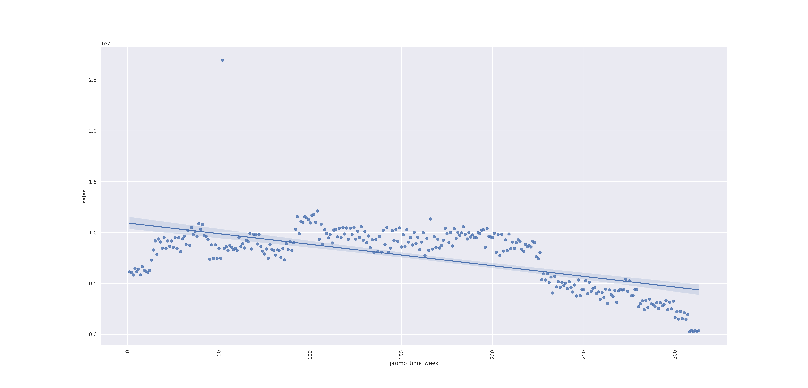

# Previsão de Vendas Lojas Rossmann

Projeto de Regressão

## 1. Problema de Negócio

Rossmann é uma das maiores redes de farmácias na Europa, com mais de 3,000 lojas em vários países. Este projeto teve início em uma competição no Kaggle, levantado pela própria Rossmann, em 2015. O objetivo principal é realizar a previsão do total de vendas para cada uma das 1115 lojas nas próximas 6 semanas.

Como parte da disciplina 'Data Science em Produção', da Comunidade DS, foi adicionado um contexto ficional, descrito abaixo, para agregar mais intensidade ao projeto.

> Vocẽ é cientista de dados na Rossmann. Após a reunião mensal dos gerentes de lojas com o CFO da empresa, foi pedido a eles uma previsão de vendas para as próximas 6 semenas. Foi estipulado um tempo de 15 dias para que os gerentes apresentem o resultado. Como o tempo é muito curto, eles decidiram pedir ajuda para o time de Data Science da empresa.
> Após conversar com o CFO, para entender a raiz do problema e descobrir se uma previsão realmente é a melhor solução, você descobriu que a empresa vai entrar em processo de expansão. Como parte do planejamento, foi decidido que a renda das próximas 6 semanas será usadas como investimento para a expansão. Além disso ele te pediu para criar alguma forma de visualização que ele e os gerentes de lojas pudessem acessar facilmente a qualquer momento.

| Problema | Causa Raiz | Questão principal |
| --- | --- | --- |
| Quanto dinheiro haverá disponível | Expansão da empresa | Qual será o total de vendas nas próximas 6 semanas? |

## 2. Suposições de Negócio
- Considerei que a variável 'customer' é uma variável indisponível. Ela possui alta correlação com as vendas, mas não tenho acesso a previsão do número de clientes para as próximas semanas.
- Lojas com dados de 'competition_distance' indisponíveis são consideradas como não tendo competidores.
- Algumas lojas têm concorrêntes próximos, mas não têm o dado 'competition_since_month/year'. Irei considerar essa data como data de vendas mais antiga.
- Não são considerados dias vendas iguais a 0 ou loja fechada. 


## 3. Desenvolvimento da Solução
### 3.1. Produto Final
- Um reporte em csv com as previsões de todas as lojas.
- Bot no Telegram acessado por API

### 3.2. Ferramentas
- Python, Jupyter Notebook, VS Code
- Render
- Telegram, API Flask
- Git, Github

### 3.3. Processo
O processo de solução do projeto é baseado na metodologia CRISP-DM, que é a sigla apra Cross Industry Process - Data Mining. É uma metodologia ágil que fornece uma estrutura robusta para planejamento de projetos de Machine Learning. Funciona como um processo cíclico, focado em entrega incremental a cada novo ciclo.




* **Passo 01:** Descrição dos Dados: limpeza e descrição estatistica dos dados, afim de encontrar erros e comportamentos incomuns.
* **Passo 02:** Feature engineering: derivação de novas features, para modelar melhor o fenômeno.
* **Passo 03:** Filtragem de variáveis: remover linhas e colunas não necessárias para o modelo.
* **Passo 04:** Análise Exploratória de Dados: validação de hipóteses, busca por insights e entender melhor o impacto das variáveis no fenômeno.
* **Passo 05:** Preparação dos Dados: adequação dos dados para que o modelo de Machine Learning possa aprender corretamente.
* **Passo 06:** Seleção de Variáveis: selecionar as features mais significantes para treinar o modelo.
* **Passo 07:** Modelagem do Modelo: testar diferentes algoritmos de Machine Learning e comparar os resultados, afim de escolher um que perfome melhor para o conjunto de dados.
* **Passo 08:** Fine Tunnig: escolher os melhores valores para os hiperparâmetros do modelo selecionado anteriormente.
* **Passo 09:** Avaliação e Interpretação do Erro: converter o a performance do modelo de Machine Learnig em resultados de negócio.
* **Passo 10:** Deploy do model em produçãp: publicar o modelo em um ambiente de nuvem para que os envolvidos no projeto consigam acessar os resultados e melhorar suas decições de negócio.
    
# 4. Coleta de Dados

- **Dataset foi coletado no Kaglle: [clique aqui](https://www.kaggle.com/competitions/rossmann-store-sales‘)**
    
	O Dataset contêm dados histórcios de vendas de 1,115 lojas, algumas das quais foram fechadas temporariamente para reforma.
    
- **O dataset contêm 19 atributos**

| Item | Descrição |
| --- | --- |
| Id  | representa uma dupla, loja e data, dentro do dataset |
| Store | identificador único para cada loja |
| DayOfWeek | dia da semana |
| Date | datae |
| Customers |  número de clientes em um determinado dia |
| Open | indicador de se a loja estava aberta ou fechada: 0 = fechada, 1 = aberta |
| Promo | indica se a loja está executando uma promoção naquele dia |
| SchoolHoliday |  indica se a Loja foi afetado pelo fechamento das escolas públicas. |
| StateHoliday | indica um feriado estadual. Normalmente, todas as lojas, com poucas exceções, estão fechadas em feriados estaduais. |
| Assortment | descreve um nível de sortimento: a = básico, b = extra, c = estendido |
| CompetitionDistance | distância em metros até a loja concorrente mais próxima |
| CompetitionOpenSinceMonth/Year | dá o ano e o mês aproximado de quando o concorrente mais próximo foi aberto |
| Promo2 | é uma promoção contínua e consecutiva para algumas lojas: 0 = loja não está participando, 1 = loja está participando |
| Promo2SinceWeek/Year | descreve o ano e a semana do calendário em que a loja começou a participar da Promo2 |
| PromoInterval | descreve os intervalos consecutivos em que o Promo2 é iniciado, nomeando os meses em que a promoção é iniciada novamente. Por exemplo, "Fev, Maio, Agosto, Novembro" significa que cada rodada começa em fevereiro, maio, agosto, novembro de qualquer ano para aquela loja |
| Sales | volume de vendas para determinado dia  |


    
## 5. Top 3 Insights

### 5.1. Insights

Algumas hipóteses de negócio foram levantadas, para serem validadas ou não. No total foram levantadas 12 hipóteses, e dentro delas aqui estão os 3 top insights retirados da análise de dados e validação das hipoteses.

| Insight 01 - Lojas com competidores mais próximos vendem mais |
| --- |
|  |

| **Insight 02 - Lojas com competidores há mais tempo vendem menos** |
| --- |
|  | 

| **Insight 03 - Lojas com promoçõe ativas por mais tempo tendem a vender menos** | 
| --- |
|  | 


# 6. Machine Learning Model Applied

After modelling data using encoding and transformation, Boruta was used as a method of feature selection. The variables relevant to model according to Boruta were.

['store', 'promo', 'store_type', 'assortment', 'competition_distance', 'competition_open_since_month',
 'competition_open_since_year', 'promo2', 'promo2_since_week', 'promo2_since_year', 'competition_time_month',
 'promo_time_week', 'day_of_week_sin', 'day_of_week_cos', 'month_cos', 'day_sin', 'day_cos', 'week_of_year_cos']

We also add 'month_sin' and 'week_of_year_sin' since they are related to their cosseno variables pairs.

A total of five models were tested:
* Average
* Linear Regression
* Lasso
* Random Forest
* XGBoost

To calculated real performance, cross validation methos was used. Since is a time based problem, we could not separate validation and training parts randomly. Thus, the final six weeks of data were separate for test only, and the rest were used in cross validation. The K number is the number of parts the cross validation data is separated. Note that for every unit added in K number the previous validation data is added to training and a new six weeks of data is agregated for validation.


After cross validation, the real model performance could be observed as below:


Note that the Average Model have better performance than linear models, indicating that phenomenon is complex. Performance for Random Forest is slightly better than XGBoost Regressor, but the model chosen was XGBoost. The reason for this is simple, Random Forest generated a much larger model and for now the gain in memory use is better than a slightly increase in performance.


# 7. Model Performance

The strategy chosen for fine tunning was Random Search, since this is the first CRISP cycle and we want to deliver a first version of solution as soon as posible. After five iterations the best set of parameters were found:

```
param_tuned = { 
		n_estimators': 3000,
		'eta': 0.03,
 		'max_depth': 5,
  		'subsample': 0.7,
   		'colsample_bytree': 0.7,
    		'min_child_weight': 3
    		}
```

Training the model again with the hyperparameters and cross validation we could find the final performance of trained model. This trained model was saved by pickle module to be send to production later.


Plotting the feature importance, we can also observed what are the variables more important to the model.


# 8. Deployment
After validation by business team the model was send to production, which means the model need to be available to final user. Throughout an API called 'handler.py created with Flask module, the model saved in previous step and the Rossmann class are requested. Rossmann class is responsable for data preparation and transformation. Deployment arquitecture is represented below.


Below you can see the telegram app working:


# 9. Business Results

Considering MAE the best metric to explain performance to business team in absolutes terms, we have calculated worst and best scenario by adding or subtracting MAE from prediction. MAPE is the MAE in percentagem that helps explain relative error.


[See entire table here in csv](output/stores-prediction.csv)

As explained in the business statement part of sales for next 6 weeks will be use as investment in company expansion. Comparing sales from XGBoost model and the average model using test data we have:

|Total Sales Baseline Model | Total Sales XGB Model | Real Sales | Difference Baseline | Difference XGB model |
| --- | --- | --- | --- | --- |
| $276,978,801.43 | $286,922,284.67 | $289,571,750.00 | $12,592,948.57 | $2,649,466.00 |

Thus, the differente between the baseline model representing how sales would be calculated if the model did not exist and de model's prediction will be $9,943,482.57. Assuming all sales for the next 6 weeks would be used as the expansion investment, this will be the amount of money company will avoid to loan from the bank.


# 10. Conclusion
We can conclude that daily sales in Rossmann stores can be predicted by the model trained in this project and business team has validated the model to go to production. The phenomenon is time based and it was adapted for a forest regressor algorithm, the trained mode has achieved an 958.72 RMSE after cross validation and fine tuning. The total amount of money the project could save from loan if is implementeded would be $9,943,482.57. Some valuable insights can be further checked for other improvements, such as the extended promotions.

# 11. Next Steps

- Separate train and test data since from the very beginning of the project to avoid data leakage.
- Look for external data such as weather, national events, macro indicators and etc.
- Try to group stores by region.
- Adjust competition_open_since_year/month to a single date for each store.
- Try bayesian search method in fine tunning step.
- Add a daily chart together with the prevision in telegram app.


# 12. References

[https://www.kaggle.com/competitions/rossmann-store-sales](https://www.kaggle.com/competitions/rossmann-store-sales)

[https://www.theretailbulletin.com/retail-solutions/case-study-rossmann-successful-supply-chain-coronavirus-crisis-management-11-12-2020/](https://www.theretailbulletin.com/retail-solutions/case-study-rossmann-successful-supply-chain-coronavirus-crisis-management-11-12-2020/)

[https://www.forbes.com/sites/metabrown/2015/07/29/what-it-needs-to-know-about-the-data-mining-process/?sh=6fe236bb515f](https://www.forbes.com/sites/metabrown/2015/07/29/what-it-needs-to-know-about-the-data-mining-process/?sh=6fe236bb515f)

[https://www.kaggle.com/competitions/rossmann-store-sales/discussion/17229](https://www.kaggle.com/competitions/rossmann-store-sales/discussion/17229)
